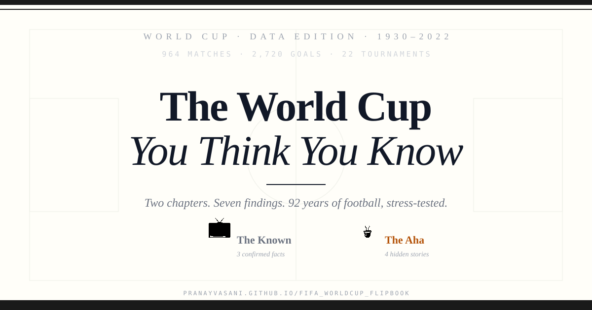

# The World Cup You Think You Know

An interactive flipbook through 92 years of FIFA Men's World Cup data — 964 matches, 2,720 goals, 22 tournaments.

**▶ Live:** https://pranayvasani.github.io/fifa_worldcup_flipbook/



## The idea

Two chapters, seven findings.

- **📺 The Known** — three things every pundit, coach, and serious fan already knows, confirmed with numbers.
- **💡 The Aha** — four findings hiding in plain sight that the sport hasn't properly reckoned with.

Why the split? Because the interesting part isn't the data — it's the gap between what people repeat on TV and what's actually sitting in the historical record.

## Findings

**Chapter One — The Known**
- **K1.** Score first, win 72.8% of the time.
- **K2.** A home-team red card crashes win-rate from 57.8% → 17.9%.
- **K3.** More bookings = tighter scoreline. Cards *are* the tension, not the cause.

**Chapter Two — The Aha**
- **A1.** The USSR won 58% of group matches and 14% of knockouts. Best in the world at the part that doesn't count.
- **A2.** Netherlands: a precise number on 50 years of heartbreak — −18 points group → knockout.
- **A3.** West Germany hit 92.9% from the spot in shootouts. England's misses are everywhere; nobody asks why Germany never missed.
- **A4.** Since 2010, 10.2% of all World Cup goals happen *after* the 90th minute. The final whistle isn't where you think it is.

## Stack

Vite + React, no backend. Single-component flipbook (`src/Flipbook.jsx`), auto-deployed to GitHub Pages via Actions.

```bash
npm install
npm run dev      # local
npm run build    # production
```

## Data

[Fjelstul World Cup Database](https://github.com/jfjelstul/worldcup) — men's tournaments, 1930–2022.

## License

MIT.
